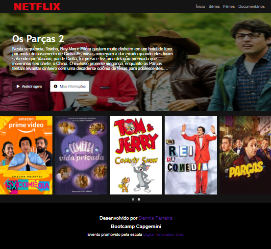

<h2>Mini Curso - Recriando a interface do Netflix</h2>

Esse projeto foi desenvolvido durante o bootcamp da [Capgemini](https://www.capgemini.com/br-pt/) em parceria com a [Digital Innovation One](https://web.digitalinnovation.one/home). O mini curso foi ministrado por [Felipe Silva Aguiar](https://github.com/felipeAguiarCode) e pode ser acessado nesse [link](https://web.digitalinnovation.one/lab/recriando-a-interface-do-netflix/learning/d75bfc6e-a532-47d9-a18d-b5b6c43a660e).

O projeto foi desenvolvido utilizando tecnologias simples como HTML5, CSS3 e JavaScript e foram abordados os seguintes tópicos:

* Estruturação de um layout
* Técnicas de CSS3 com containers e variáveis
* Posicionamento de elementos HTML com flexbox
* Utilização de ícones armazenados na nuvem com Font Awesome
* Utilização do plugin JQuery Owl Carousel para construção de um carrossel de imagens

Abaixo, seguem links bem bacanas, sobre tópicos mencionados durante a aula:

* [Site do Owl Carousel](https://owlcarousel2.github.io/OwlCarousel2/)
* [Site do Font Awesome](https://fontawesome.com/)
* [Documentação HTML](https://developer.mozilla.org/pt-BR/docs/Web/HTML)
* [Documentação CSS3](https://developer.mozilla.org/pt-BR/docs/Web/CSS)
